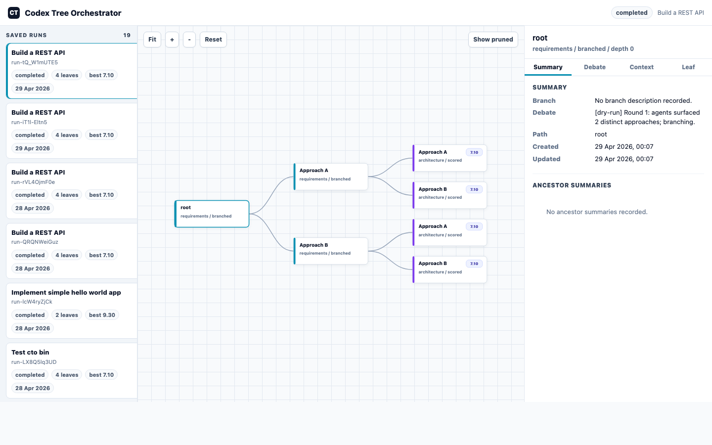

# Cambrian Tree Orchestrator (CTO)


Cambrian turns a single software intent into an explored solution tree. It decomposes the task into a stable intent dossier, selects the right agent panel, debates grounded alternatives, optionally pauses for human plan review, sketches and ranks implementation leaves before expensive execution, verifies implementations when checks are configured, ranks results with evidence-aware fitness, and saves the whole run for inspection in a local browser UI.

It is built for the moment when "ask one agent once" stops being enough: when you want competing implementation strategies, visible trade-offs, resumable execution, and a ranked set of candidate solutions instead of a single opaque answer.

## Project Goals

CTO is designed around five core principles:

1. **Visible deliberation** — the decision trail matters as much as the output. Every branch, rejection, coverage gap, and debate round is saved and inspectable. You can see *why* an approach was chosen, not just *what* it produced.

2. **Competitive alternatives** — strong solutions come from competing strategies, not a single chain of thought. CTO runs independent branches, attacks each alternative adversarially before committing resources, and ranks the survivors by evidence rather than rhetoric.

3. **Human-in-the-loop at the right moment** — human review is expensive and should happen before expensive work, not after. The interactive plan gate lets you redirect, refine, or kill a branch before Codex execution, not after it finishes.

4. **Evidence over invention** — agents must not hallucinate facts, benchmarks, schemas, or constraints. Verified ground truth, allowlisted research tools, and the anti-hallucination persona rules exist to enforce this. Deterministic fitness scoring ensures that a passing verification suite outweighs a persuasive judge narrative.

5. **A system that improves over time** — isolated one-shot runs are a starting point, not the destination. The long-term goal is a system that learns from past run outcomes, routes queries to the right model tier automatically, and accesses real-time evidence without inventing it.

## Highlights

- **Intent decomposition** — load-bearing claims, undefined terms, scope boundaries, known unknowns, and feasibility flags are extracted before debate.
- **Intent dossier** — the raw intent and decomposition are converted into a stable goal, constraints, acceptance criteria, risks, success signals, and failure modes.
- **Round-table agent debate** — core delivery roles and optional specialists critique the intent from different angles.
- **Organic branching** — the moderator forks only when agents surface meaningfully different, grounded implementation paths.
- **Implementation or exploration mode** — code-producing tasks execute through Codex; research tasks produce synthesized leaf documents.
- **Critic pre-execution evaluator** — a Critic module audits each consensus for coverage gaps, adversarially attacks each surviving alternative before branching, and produces implementation sketches with 5-axis decision axes (reversibility, blast radius, time-to-signal, counter-case, falsifier) in one call at leaves. Intent-derived dimensions (security, performance, compliance, accessibility, concurrency) are added automatically based on the intent text.
- **Sketch-first execution** — the Critic ranks leaves via deterministic axes instead of a numeric score; CTO executes the top candidates by default and keeps skipped leaf evidence for inspection.
- **Compact debate memory** — later rounds receive concise structured debate state instead of the full prior transcript, while full transcripts remain saved.
- **Deterministic cache** — stable analysis, dossier, compact-summary, verification, and judge results are cached under `.cambrian-tree/cache/`.
- **Verified ground truth** — inject JSON facts, sample data, or OpenAPI specs so agents do not invent schemas, APIs, or constraints.
- **Agent-requested research tools** — personas can request allowlisted read-only tools during debate; CTO resolves them through a broker and feeds compact evidence back into the moderator and later rounds.
- **Human plan gate** — review candidate leaves in the terminal or browser, revise one branch, or kill weak directions early.
- **Evidence-aware fitness** — optional verification commands and LLM judge evidence are combined into a deterministic fitness score used for final ranking.
- **Parallel execution with usage accounting** — run leaves concurrently and track LLM plus Codex input, cached input, output, and reasoning tokens.
- **Saved-run UI** — inspect the tree, debate history, context updates, execution output, Codex usage, judge scores, and fitness scores in a local browser.

## How It Works

1. You provide a high-level intent (`"Build a REST API for a todo app"`) and optional verified ground truth
2. The analyzer decomposes the intent, builds an intent dossier, chooses implementation or exploration mode, and selects the relevant core and specialist agents
3. When agents surface fundamentally different approaches, the tree **branches** — each alternative becomes an independent child node
4. When agents converge, the tree deepens into the next phase
5. If `--interactive-plan` is enabled, each candidate leaf pauses for a human decision: proceed, revise once, or kill
6. In implementation mode, surviving leaf nodes are sketched, ranked, and the top candidates are submitted to OpenAI Codex for implementation
7. In exploration mode, surviving leaf nodes produce structured synthesis documents instead of code
8. Implementation results are judged on six dimensions, combined with verification evidence into a fitness score, and ranked

See [docs/architecture.md](docs/architecture.md) for the system diagrams and layer-by-layer architecture.

## Prerequisites

- Node.js 18+
- An LLM provider API key for debate and judging:
  - `OPENAI_API_KEY` for `--provider openai`
  - `OPENROUTER_API_KEY` for `--provider openrouter`
  - `GEMINI_API_KEY` for `--provider gemini`
  - `DEEPSEEK_API_KEY` for `--provider deepseek`
  - `ANTHROPIC_API_KEY` for `--provider claude`
  - `EDENAI_API_KEY` for `--provider edenai`
- OpenAI Codex CLI installed and authenticated (for leaf execution):
  ```bash
  npm install -g @openai/codex
  codex login
  ```

## Install

```bash
npm install
npm run build
npm link    # puts the `cto` bin on your PATH
```

For development without installing the bin, replace `cto` with `npx tsx src/cli/index.ts` in any of the commands below — both work identically.

## Development Checks

```bash
npm run docs:check   # Fail when code-impacting changes omit README/AGENTS/CLAUDE/docs updates
npm run typecheck    # TypeScript verification
npm test             # docs:check + Vitest
```

`docs:check` compares the branch and working tree against the base branch. If files under `src/`, `tests/`, `scripts/`, package metadata, or workflow/config files change, at least one of `README.md`, `AGENTS.md`, `CLAUDE.md`, or `docs/**` must change too. For a truly mechanical change with no user-facing, agent-facing, or architecture impact, run the check with `DOCS_IMPACT=none`.

## Quick Start

```bash
cto run "Build a hello world Express API" --depth 3 --branching 2
```

Before the run starts, the CLI prints a cost estimate and asks for confirmation:

```
🌳 Cambrian Tree Orchestrator — Pre-run Estimate
Tree size:    ~7 nodes (worst case: 7), ~4 leaves (worst case: 4)
LLM tokens:   ~145,200 total (124,800 debate, 20,400 judge)
LLM cost:     ~$0.61
Codex calls:  top-ranked leaf executions after sketch ranking (default: 2)

Proceed? [y/N]
```

Use `-y` to skip the prompt, or `--dry-run` to exercise the tree shape without any LLM or Codex calls:

```bash
# auto-approve the estimate
cto run "Build X" -y

# debate-tree shape only, no API key required
cto run "Build X" --dry-run

npx tsx src/cli/index.ts run "Use local repo patterns before proposing changes" --tools repo-search,repo-read,package-info
npx tsx src/cli/index.ts run "Inspect package metadata before choosing dependencies" --tools package-info,repo-search
```

### LLM Providers

CTO can run the debate, analyzer, synthesis, and judge calls through a standalone provider runtime in `packages/llm-providers`. OpenAI, OpenRouter, Gemini, DeepSeek, and EdenAI use an OpenAI-compatible adapter; Claude uses Anthropic's native Messages API adapter. Leaf implementation still uses Codex unless the run is in exploration mode or `--dry-run`.

```bash
# OpenRouter, default model: openai/gpt-oss-120b:free
OPENROUTER_API_KEY=... cto run "Build X" --provider openrouter

# Google Gemini, default model: gemini-3-flash-preview
GEMINI_API_KEY=... cto run "Build X" --provider gemini

# DeepSeek, default model: deepseek-v4-pro
DEEPSEEK_API_KEY=... cto run "Build X" --provider deepseek

# Claude / Anthropic, default model: claude-sonnet-4-5
ANTHROPIC_API_KEY=... cto run "Build X" --provider claude

# EdenAI gateway, default model: openai/gpt-4o
EDENAI_API_KEY=... cto run "Build X" --provider edenai

# Override any provider default
cto run "Build X" --provider openrouter --model openai/gpt-oss-120b:free
```

Provider defaults, model tiers, fallback policy, and adapter selection live in `packages/llm-providers`. CTO call sites import the runtime directly from `@cto/llm-providers` instead of through a local re-export. You can still override the provider endpoint or API-key variable with `--base-url` and `--api-key-env`, which is useful for proxies, self-hosted gateways, or alternate provider accounts. EdenAI uses the V3 OpenAI-compatible gateway at `https://api.edenai.run/v3`; model IDs use EdenAI's `provider/model` format, and `--model @edenai` delegates model choice to EdenAI smart routing.

For richer routing, create `llm-providers.config.mjs`, `llm-providers.config.js`, `llm-providers.config.cjs`, or `llm-providers.config.json` in the repo root. When that file exists and the run does not explicitly pass `--provider` or `--model`, CTO maps its internal stages to provider-package tiers (`cheap`, `mid`, `strong`). Each tier is an ordered fallback list, so a free OpenRouter model can fall through to another provider on rate limits, timeouts, overloaded responses, or server errors without adding tier-specific CLI flags.

```json
{
  "modelTiers": {
    "cheap": [
      { "provider": "openrouter", "model": "openai/gpt-oss-120b:free" },
      { "provider": "gemini", "model": "gemini-3-flash-preview" }
    ],
    "mid": [
      { "provider": "openrouter", "model": "openai/gpt-oss-120b:free" },
      { "provider": "deepseek", "model": "deepseek-v4-pro" }
    ],
    "strong": [
      { "provider": "openai", "model": "gpt-4o" },
      { "provider": "claude", "model": "claude-sonnet-4-5" }
    ]
  }
}
```

Live provider smoke tests are opt-in because they use real API keys and can fail for current provider-side reasons such as exhausted credits, free-model rate limits, or model availability:

```bash
# Run every provider with a configured key
npm run test:live-providers

# Narrow to one or more providers while debugging
CTO_LIVE_PROVIDER_FILTER=openai npm run test:live-providers
CTO_LIVE_PROVIDER_FILTER=openai,gemini npm run test:live-providers
CTO_LIVE_PROVIDER_FILTER=edenai npm run test:live-providers
```

The live suite checks three things per provider: normalized text/usage/attempt metadata in the provider package, plus CTO-style JSON extraction and a real `TaskAnalyzer` call in CTO's own test tree. Use `CTO_LIVE_<PROVIDER>_MODEL` to override a model for one run, for example `CTO_LIVE_OPENROUTER_MODEL=openai/gpt-oss-120b:free` or `CTO_LIVE_EDENAI_MODEL=anthropic/claude-sonnet-4-5`. `CTO_LIVE_PROVIDER_TIMEOUT_MS` controls the per-request timeout.

Gemini uses OpenAI-compatible `reasoning_effort: "minimal"` by default. Without that, Gemini 3's dynamic thinking can consume the short structured-call budget and truncate JSON responses before CTO can parse them.

OpenRouter `:free` models can return provider-side `429` rate-limit errors under load. Tier-routed runs can fall back to the next candidate for fallback-safe provider failures; explicit `--provider` / `--model` runs keep the old single-model behavior and report the request failure directly.

Claude is the one provider here that is not OpenAI-compatible at the wire level: Anthropic expects a native `/v1/messages` request with top-level `system`, `messages`, `max_tokens`, `x-api-key`, and `anthropic-version`. CTO normalizes that response into the same internal text and token-usage shape used by the OpenAI-compatible providers. Claude prompt-cache telemetry is recorded when returned, but CTO does not inject `cache_control` blocks in this first pass.

To inspect saved or running runs visually:

```bash
cto ui
```

This launches a local run monitor with a saved-run picker, live tree canvas, zoom controls, inspector tabs, score badges, Codex usage summaries, and browser controls for pending human plan reviews. It updates running runs in near real time from the saved `.cambrian-tree` state.



## CLI Reference

### `run` — start a new orchestration

```
cto run "<intent>" [options]

Options:
  -d, --depth <n>            Maximum tree depth                (default: 6)
  -b, --branching <n>        Maximum branches per node         (default: 3)
  -r, --rounds <n>           Maximum debate rounds/node        (default: 3)
  -m, --model <model>        Reasoning + judge model           (default: gpt-4o)
      --provider <provider>  LLM provider: openai, openrouter,
                             gemini, deepseek, claude, or edenai
      --base-url <url>       Override provider base URL
      --api-key-env <name>   Env var containing the provider API key
  -w, --workdir <path>       Working dir for Codex             (default: cwd)
      --token-budget <n>     Warn when LLM tokens exceed n
      --leaf-concurrency <n> Max parallel leaf Codex executions (default: 4)
      --prune-threshold <n>  Drop alternatives below confidence × relevance
                             0–1 (default: 0.5)
      --prune-schedule <s>   Depth-aware prune schedule, e.g.
                             0:0.45,1:0.6,3:0.8
      --cloud-env <id>       Use Codex Cloud env instead of local SDK
      --cloud-attempts <n>   Best-of-N attempts when --cloud-env is set
                             (default: 1)
      --verify <command>     Verification command to run after each leaf
                             execution; repeat for multiple commands
      --verify-timeout <ms>  Verification command timeout (default: 300000)
      --dry-run              No LLM or Codex calls — exercise tree shape only
      --ground-truth <spec>  Inject verified facts from file:, sample:, or
                             openapi: sources
      --tools <tools>        Comma-separated allowlist of read-only research
                             tools agents may request during debate
      --no-tools             Disable agent-requested research tools
      --interactive-plan     Review candidate leaves before implementation
      --monitor              Open the live browser monitor for this run
      --ui-review            Use the browser UI for interactive plan decisions
  -y, --yes                  Skip pre-run cost confirmation
```

Each leaf runs in its own subdirectory: `<workdir>/<node-id>/`. Solutions are independent and can be diffed against each other.

Use `--verify` when you want CTO to run deterministic checks after each local Codex leaf execution:

```bash
cto run "Build X" --verify "npm test" --verify "npm run typecheck"
```

Verification commands run in the leaf artifact directory and are captured in saved state with pass/fail counts, stdout, stderr, and timeout metadata. They are skipped in `--dry-run` mode and skipped for `--cloud-env` submissions until cloud results have been applied locally.

Use `--prune-schedule` when early branches should survive with a lower bar but later branches should be held to a stricter threshold:

```bash
cto run "Build X" --prune-schedule "0:0.45,1:0.6,3:0.8"
```

At each node, CTO uses the nearest scheduled threshold at or below that depth. If no schedule point applies, it falls back to `--prune-threshold`.

Use `--ground-truth` when agents need source-checked facts instead of inferred assumptions:

```bash
cto run "Build an API for this schema" --ground-truth openapi:./openapi.yaml
cto run "Analyze this export and propose a migration" --ground-truth sample:./export.csv
cto run "Build from these domain constraints" --ground-truth file:./facts.json
```

`file:` expects JSON matching the `DomainFacts` shape: `domain`, optional `schemas`, optional `apiEndpoints`, `constraints`, `knownAbsences`, and optional `rawContext`. `sample:` reads CSV or JSON data and extracts a schema summary. `openapi:` reads JSON or YAML OpenAPI specs and extracts routes plus component schemas.

### Agent-Requested Research Tools

Use `--tools` when agents need local repo or package evidence during debate:

```bash
cto run "How is this codebase structured?" --tools repo-map,repo-read
cto run "Follow local CLI option patterns" --tools repo-search,repo-read,package-info
cto run "Inspect dependency metadata before proposing changes" --tools package-info,repo-search
```

Phase 1 ships functional local adapters for `repo-map`, `repo-search`, `repo-read`, and `package-info`. `web-search`, `web-fetch`, and `docs-fetch` are reserved allowlisted names for future/provider-backed adapters; until they are wired to a real provider, requests for them return unavailable evidence rather than live web, webpage, or vendor-doc results.

`repo-map` summarizes root files, top-level directories, and representative files for codebase-structure questions.
`repo-search` prefers ripgrep (`rg`) for fast local search. If `rg` is not available in the launch environment, CTO falls back to Git-tracked files and then to a filesystem walk with default excludes. Set `CTO_RIPGREP_PATH` to pin the exact `rg` binary when a non-shell launcher has a narrow `PATH`.

Tools are read-only and orchestrator-mediated. Agents emit `TOOL_REQUEST [tool-name]: query`; CTO validates the request, applies budgets, resolves allowlisted tools, and stores `ToolRequest` and `ToolEvidence` records in saved state. Tool evidence is compacted into later agent prompts and the moderator prompt, while skipped, unavailable, or failed requests remain visible for audit.

Use `--interactive-plan` when you want a human checkpoint before leaf execution or exploration synthesis. CTO will pause on each candidate leaf and let you proceed, revise once with a new prompt that creates a debated child branch, or kill the branch before expensive work starts.

Use `--monitor` to open the local browser monitor when the run starts:

```bash
cto run "Build X" --monitor
```

Use `--ui-review` to combine the interactive plan gate with browser-based decisions:

```bash
cto run "Build X" --ui-review
```

When a candidate leaf needs review, the selected node inspector shows Proceed, Revise, and Kill controls. Browser decisions are written as control files under `.cambrian-tree/<run-id>/control/`; the orchestrator remains the only writer of canonical `state.json`.

Interactive plan decisions are saved in `.cambrian-tree/<run-id>/state.json`. Revised branches receive a `human-revision` child node, and the revision prompt is included in the next debate plus the final implementation or synthesis prompt. Descendants of a human revision are not prompted again in v1, which keeps the mode to one revision opportunity per original candidate leaf.

## Run Modes

CTO classifies each intent before the tree is built:

- **Implementation** — feature work, bug fixes, refactors, APIs, services, and other code-producing tasks. Leaves execute through Codex, optional verification commands run, then the judge and deterministic fitness scorer rank the resulting implementations.
- **Exploration** — research questions, feasibility studies, data analysis, and planning spikes. Leaves produce structured synthesis documents without Codex execution or judge scoring.

The analyzer also selects specialists only when grounded in the intent or verified context. A frontend task can pull in UX and Frontend Engineering; an API contract task can pull in API / Integration Architecture; a pure research prompt can stay with Research Planner, Business Analyst, and Data Analyst. Agent role data lives in `src/agents/catalog/`, debate prompt rendering in `src/agents/prompts/`, and response extraction in `src/agents/parsing/`; `src/agents/definitions.ts` remains the stable public facade.

### `list` — show all saved runs

```
cto list
```

### `show <run-id>` — print ranked results for a run

```
cto show run-abc123
```

### `tree <run-id>` — print the solution tree

```
cto tree run-abc123
```

### `ui [run-id]` — launch the live browser monitor

```
cto ui [run-id] [--port 43187] [--no-open]
```

The UI reads saved state from `.cambrian-tree`, serves a local browser app, streams selected run snapshots, and lets you inspect:

- saved runs and run metadata
- the full branch tree as an interactive canvas, with zoom controls, fitness-aware score badges, phase/status styling, and a show-pruned toggle
- node summaries, run config/model routing, selected agents, ranked results, debate rounds, compact debate state, intent decomposition/dossiers, accumulated context updates, leaf sketches, verification output, changed files, tests, Codex usage, judge evidence, and fitness evidence
- aggregate and per-leaf Codex usage totals when usage data is available
- pending human plan reviews, with Proceed / Revise / Kill controls when the run is waiting for browser input

If `run-id` is provided, the UI opens that run directly. Use `--no-open` to print the local URL without opening a browser.

### `resume <run-id>` — continue a paused or failed run

```
cto resume run-abc123 [--provider <provider>] [--model <model>] [--base-url <url>] [--api-key-env <name>] [--dry-run] [--leaf-concurrency <n>] [--interactive-plan] [--monitor] [--ui-review]
```

Press **Ctrl+C** at any time during a run to pause it — state is saved and you can resume later.

Resume uses the provider, base URL, API-key env, and model saved in the run config. Pass `--provider`, `--model`, `--base-url`, or `--api-key-env` only when you want to override the saved settings.

Interactive plan state is also resumable. Already-reviewed leaves are not prompted again, killed leaves remain pruned, and `cto resume <run-id> --interactive-plan` can enable the gate for an older paused run.

## Cost Control

CTO now reduces cost by default before you touch any knobs: debate rounds use compact prior context after round 1, deterministic analysis and evidence results are cached, and implementation leaves are sketched and ranked before Codex execution. The default implementation flow is:

```text
Explore broadly → sketch cheaply → rank sketches → execute top 2 → verify/judge → execute the next ranked sketch only if required verification fails for all selected leaves
```

Seven knobs still control how much a run will cost:

1. **Tree size** — `--depth` × `--branching` is the worst-case node count (exponential). The pre-run estimator computes both worst case and an expected case (assumes ~50% of debates branch).
2. **Pruning** — set `--prune-threshold 0.6` (or similar) to drop alternatives the moderator is unsure about. Below-threshold alternatives never get a debate or a Codex execution. If only one alternative survives, it folds into a consensus child (single path, not a branch). Use `--prune-schedule "0:0.45,2:0.7,4:0.85"` to prune gently early and strictly later.
3. **Sketch-first execution** — CTO executes only the top 2 ranked implementation sketches by default. Other leaves remain in the saved tree with their sketch, score, and skipped reason.
4. **Concurrency** — `--leaf-concurrency` controls how many Codex leaf executions run in parallel. Higher = faster wall-clock but more peak load. Doesn't affect total cost.
5. **Run mode** — exploration mode synthesizes documents from leaf debates and skips Codex execution plus judge scoring.
6. **Interactive planning** — `--interactive-plan` lets a human kill branches before execution or synthesis, or revise a candidate once so the agents debate the corrected direction before expensive work begins.
7. **Provider choice** — `--provider openrouter` with `:free` models can make debate and judge calls free within provider limits, while `--provider edenai` can route through EdenAI's single-key gateway to many upstream models. Unknown model pricing falls back to GPT-4o rates in estimates so the CLI errs on the conservative side.

The final summary breaks Codex token usage down by input / cached input / output / reasoning so you can see where the budget went.

## Codex Cloud (best-of-N)

If you have a Codex Cloud environment set up (`codex cloud` to browse), you can route leaf execution through it for best-of-N attempts:

```bash
cto run "Build X" --cloud-env env_abc123 --cloud-attempts 3
```

The orchestrator submits each leaf to Codex Cloud and records the task id. Cloud results are async — pull them locally with:

```bash
codex cloud status <task-id>     # check progress
codex cloud apply <task-id>      # apply the diff to the leaf workdir
```

> Codex Cloud is marked experimental upstream. The orchestrator currently submits and records the task id; polling and auto-applying diffs is not yet automated. Verification commands are skipped for cloud submissions until a cloud task has been applied locally.

## Agent Panel

CTO includes a core software-delivery panel plus opt-in specialists. A task analyzer chooses the run mode and panel before traversal. The default implementation panel is Product Manager, Business Analyst, Tech Lead, Developer, Code Reviewer, and QA Engineer; exploration runs default toward Research Planner, Business Analyst, and Data Analyst. Domain specialists are selected only when the intent or ground-truth context supports that specialty.

| Phase | Agents |
|---|---|
| Requirements | Product Manager, Business Analyst, QA Engineer |
| Architecture | Tech Lead, Business Analyst, Code Reviewer, QA Engineer |
| Implementation | Developer, Tech Lead, Code Reviewer |
| Validation | Product Manager, Business Analyst, Developer, Code Reviewer, QA Engineer |

Available specialists are Research Planner, Data Engineer, Data Analyst, Security Engineer, ML Engineer, DevOps Engineer, UX Designer, Frontend Engineer, API / Integration Architect, Performance Engineer, and Technical Writer. Each persona has explicit `Does` / `Does Not` boundaries and a shared evidence rule: do not invent facts, benchmarks, studies, prices, usage volumes, latency targets, compliance obligations, schemas, APIs, users, or business goals. Unknowns must be labelled as `UNKNOWN` / `ASSUMPTION`, asked as challenge questions, or deferred to a verification spike.

Verified ground truth, when provided, is rendered into the agent context and treated as a stronger source than agent intuition. This is the preferred way to give CTO schemas, API contracts, sample-data constraints, known absences, or domain facts.

The Research Planner is an evidence-skeptic role, not a source generator. It may only treat prior art as grounded when it appears in verified domain facts, source-checked context, or the original intent.

Each agent is prompted to surface alternatives only when the options are in scope and would lead to meaningfully different implementations. The moderator (a separate LLM call) classifies each round as **consensus**, **diverging**, or **continue**. Divergence triggers branching; consensus advances depth.

## Scoring Dimensions

The LLM judge scores each leaf solution on six weighted dimensions:

| Dimension | Weight |
|---|---|
| Functional Completeness | 25% |
| Architectural Quality | 15% |
| Test Coverage | 15% |
| Intent Alignment | 20% |
| Real-World Fit | 15% |
| Simplicity | 10% |

The final ranking uses **fitness** when available, not just the judge composite. Fitness combines:

- verification results, weighted most heavily when checks are configured
- functional completeness
- maintainability, derived from architecture and real-world fit
- simplicity
- intent alignment
- risk reduction
- cost efficiency
- an uncertainty penalty from the judge

If a required verification command fails, the fitness composite is capped so a persuasive but failing leaf cannot win on judge prose alone. CLI rankings, `cto tree`, and the saved-run UI prefer fitness scores when present while still exposing the underlying judge score and rationale.

## State & Persistence

Runs are saved to `.cambrian-tree/<run-id>/state.json` after every node. The tree is always resumable from the last completed node.

Set `CAMBRIAN_TREE_STORE_DIR` to point persistence at a different run store. This is mainly useful for tests, local experiments, and tooling that should not read or write the default `.cambrian-tree` history.

Run state records the selected run mode, selected agents, leaf IDs, ranked results for implementation runs, LLM usage, aggregate Codex usage, cache stats, model tier assignments, and any pending browser review request. Node context records the original intent, intent decomposition, intent dossier, verified domain facts, PRD notes, acceptance criteria, architecture decisions, implementation specs, test strategy, branch decisions, human revision prompts, and ancestor summaries.

Implementation leaves record an implementation sketch (including the Critic's 5-axis decision evaluation) and an optional skipped execution reason. Skipped leaves are not failures or pruned branches; they are candidates preserved after Critic-based ranking so the run can explain why Codex execution was narrowed. Consensus nodes record a coverage audit (`coverageAudit`) with any dimension gaps and a premortem narrative; gaps are surfaced in `cto tree` and `cto show`.

When interactive planning is enabled, `TreeNode.humanIntervention` records `proceed`, `revise`, or `kill`. Revision prompts are also stored on `NodeContext.humanRevisionPrompt` so subsequent debate, synthesis, and implementation prompts inherit the human steering instruction.

`cto ui` reads the same saved state and exposes it through a local-only HTTP server:

- `GET /` — browser UI
- `GET /api/runs` — saved run summaries
- `GET /api/runs/:runId` — full `RunState`
- `GET /api/runs/:runId/events` — server-sent events stream of live run snapshots
- `POST /api/runs/:runId/human-review/:requestId` — browser decision for a pending plan review
- `GET /api/health` — health check

## Project Status

| Phase | Status |
|---|---|
| Phase 1 — Running | ✅ Complete |
| Phase 2 — Hardening | ✅ Complete |
| Phase 3 — Agent quality | ✅ Complete |
| Phase 4 — Optimise (v0.2) | ✅ Complete |
| Interactive plan gate | ✅ Complete |
| Live run monitor | ✅ Complete |
| Dynamic run modes and specialist selection | ✅ Complete |
| Intent decomposition and ground-truth inputs | ✅ Complete |
| Browser plan review controls | ✅ Complete |
| Codex usage reporting in CLI and UI | ✅ Complete |
| Evolutionary foundation — intent dossier, verification, fitness ranking, progressive pruning | ✅ Complete |
| Cost-control foundation — model cascade, compact context, deterministic cache, sketch-first execution | ✅ Complete |
| Critic pre-execution evaluator — coverage audit, adversarial alternative attack, leaf decision axes, intent-derived dimensions, two-column leaf dossier in UI | ✅ Complete |
| Documentation impact guard | ✅ Complete |
| Real-time research via MCP and tool-use (web-search, web-fetch, docs-fetch wired to live providers) | Planned |
| Memory system — run-history index, past-outcome seeding for analyzer and agents | Planned |
| Provider package routing — standalone provider runtime, config-native tiers, fallback lists | ✅ Complete |
| Dynamic model profiles (`economy`, `balanced`, `quality`) | Planned |
| General refinements — Codex Cloud auto-apply, Claude cache_control injection, structured output mode, UI diff viewer | Planned |

**Phase 2 delivered:** Zod validation on all LLM responses, exponential-backoff retry (3 attempts, 1s/2s/4s), token budget tracking with warnings, graceful Ctrl+C shutdown with state save.

**Phase 3 delivered:** Structured `CONTEXT_UPDATE` fields from agents (PRD, acceptance criteria, architecture decisions, implementation spec, test strategy) accumulated and propagated into every child node's context. Agent prompts now explicitly separate prior-round history from current-round speakers, giving each agent clear visibility into who has already spoken this round. Moderator sensitivity tightened so branching requires cross-agent support and grounded, in-scope alternatives. Persona prompts include explicit specialty boundaries and shared anti-hallucination rules.

**Phase 4 delivered:** Pre-run cost estimator (expected and worst-case node/token/USD projection, model-aware pricing). Confidence-based pruning — moderator emits a 0–1 score per alternative, branches below `--prune-threshold` are dropped before exploration. Parallel leaf execution and judging via a concurrency-limited pool (`--leaf-concurrency`). Codex Cloud best-of-N support via `--cloud-env` and `--cloud-attempts`. Per-leaf token usage breakdown (input / cached input / output / reasoning) aggregated and shown in the final summary.

**Latest orchestration updates:** CTO now decomposes intent before debate, classifies runs as implementation or exploration, selects specialists dynamically, supports verified `--ground-truth` providers (`file:`, `sample:`, `openapi:`), and synthesizes exploration leaves without Codex execution.

**Evolutionary foundation delivered:** CTO now builds an intent dossier before debate, supports repeatable post-leaf verification commands, stores verification summaries in run state, ranks implementations by evidence-aware fitness, displays fitness-aware scores in CLI and UI, and supports depth-aware pruning schedules via `--prune-schedule`.

**Cost-control foundation delivered:** CTO now has internal model-tier routing without adding CLI flags, compact debate state for later rounds, deterministic cache entries for stable analysis and evidence work, and sketch-first execution that preserves broad exploration while executing only the top-ranked implementation leaves by default.

**Critic pre-execution evaluator delivered:** CTO now audits every consensus debate for coverage gaps across five fixed dimensions (correctness, fit-for-stakeholder, operability, assumptions, second-order effects) plus intent-derived dimensions (security, performance, compliance, accessibility, concurrency) derived automatically from the intent text. When gaps are found a focused follow-up round fires once; any remaining gaps are recorded as known-unknowns. At branch points every surviving alternative is adversarially attacked on five decision axes (reversibility, blast radius, time-to-signal, counter-case, falsifier); uniformly-bad alternatives are demoted before subtrees are committed. At leaves the Critic replaces the former sketcher — sketch and decision axes are produced together in one structured call, replacing the old numeric `LeafSketchScore` with a deterministic axis-based ranker. Coverage gaps are surfaced in `cto tree` (badge), `cto show`, and the saved-run UI leaf inspector (Coverage Audit section + Critic Decision Axes section).

**Documentation impact guard delivered:** `npm test` now runs `npm run docs:check` before Vitest. Code-impacting diffs must update `README.md`, `AGENTS.md`, `CLAUDE.md`, or `docs/**`, with `DOCS_IMPACT=none` available only for explicitly no-docs-impact changes.

**Interactive plan gate delivered:** `--interactive-plan` pauses after debate traversal and before leaf execution or synthesis. The human can proceed, revise once with a new prompt that creates a debated `human-revision` child, or kill a branch. Decisions persist into run state and resume without re-prompting already-reviewed leaves. `--ui-review` exposes the same decision flow in the saved-run UI.

**Live run monitor delivered:** `cto ui` launches a dependency-light local browser monitor for saved and running `.cambrian-tree` runs. It includes a run picker, dark SVG tree canvas, node selection, inspector tabs for summary/debate/context/leaf details, score badges, Codex usage totals, server-sent event updates for the selected run, browser controls for pending interactive plan reviews, local JSON/control API routes, and run-id validation before loading state.

## Roadmap — Pre-v1

Four tracks are under active consideration before v1.0. None of the code below exists yet — these are planned features.

### Track 1 — Real-time Research via MCP and Tool-Use

The tool names `web-search`, `web-fetch`, and `docs-fetch` are already allowlisted in the `ToolName` type and the `--tools` flag, but they currently return "unavailable" stub responses instead of live data. Pre-v1, these will be wired to real MCP-compatible providers:

- **web-search** → a search API (e.g. Brave Search, Exa) so agents can find package changelogs, security advisories, and community benchmarks during debate without hallucinating them
- **web-fetch** → a headless fetch adapter (e.g. Firecrawl, Jina Reader) for structured extraction from documentation pages and issue trackers
- **docs-fetch** → vendor-specific doc APIs (npm registry, PyPI, crates.io, GitHub API) for authoritative dependency metadata

This track is gated behind provider API keys (real-time web calls cost money). The broker interface is already in place; the work is writing the adapter implementations and exposing provider config through the CLI or environment.

Goal: agents can pull live, sourced evidence during debate. The Research Planner's "UNKNOWN / ASSUMPTION" discipline is the complement — the tool gives the agent real data so it has less reason to invent.

### Track 2 — Memory System

Each CTO run is currently isolated. The orchestrator has no access to prior run outcomes, successful patterns, or known-bad directions from earlier sessions.

Pre-v1 plan:
- A lightweight run-memory index stored alongside `.cambrian-tree/` that records intent fingerprints, fitness outcomes, judge narrative summaries, and agent context updates from completed runs
- The analyzer queries this store before building the dossier: seeding accepted facts, known-bad alternatives, and domain decisions that were settled in prior runs
- The agent prompt builder can inject compact "prior run context" so agents do not re-debate already-resolved questions
- Memory is opt-in and user-controlled (delete or scope the store)

Goal: repeated runs on similar intents produce higher-quality results faster because settled ground is not re-debated and failed approaches are not re-explored.

### Track 3 — Dynamic Model Selection and Cost-Aware Fallback

The provider runtime now supports config-driven tiers and fallback lists without adding tier-specific CLI flags. CTO maps analyzer, moderator, summarizer, debate, critic/sketch, synthesis, and judge stages onto `cheap`, `mid`, and `strong` tiers. Future work can add named profiles such as `economy`, `balanced`, or `quality` on top of this package-level routing once real usage data shows the presets are worth maintaining.

### Track 4 — General Refinements

Smaller improvements that are blocked on the above tracks or polish items for v1:

- **Codex Cloud auto-apply** — the orchestrator currently submits tasks and records task IDs but polling and local diff application is manual. Pre-v1: optional `--cloud-poll` that polls for completion and applies diffs automatically so cloud and local leaf results are handled uniformly.
- **Claude `cache_control` injection** — CTO records Claude prompt-cache telemetry when it is returned, but does not yet inject `cache_control` blocks on long stable prompts. Adding this for the dossier, agent system prompts, and ground-truth blocks will reduce Anthropic costs on multi-round runs significantly.
- **Structured output mode** — all providers support structured output or JSON mode to varying degrees. Enabling this across the board will reduce JSON parse failures on constrained models (especially Gemini and DeepSeek at high concurrency).
- **UI diff viewer** — side-by-side leaf implementation diff, debate replay, and a timeline view for the node inspector are the most-requested UI improvements.
- **Tool evidence deduplication** — today tool evidence is compacted inline per-agent. Pre-v1: deduplicate across agents, rank by relevance before injection, and surface a tool-evidence summary tab in the UI.

## License

Licensed under the Apache License, Version 2.0. See [LICENSE](LICENSE).

See [CLAUDE.md](CLAUDE.md) for the full work plan and known issues.
