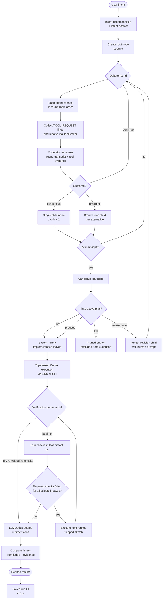
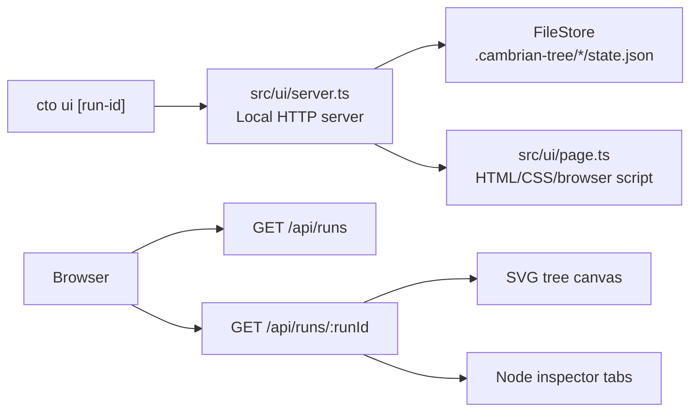
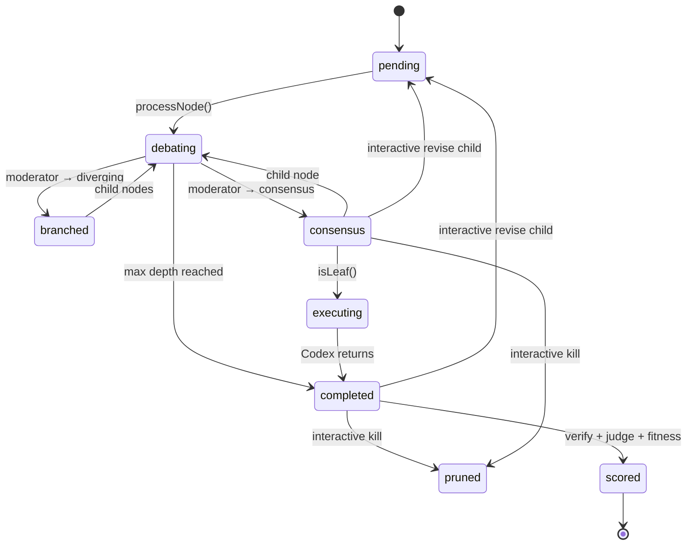
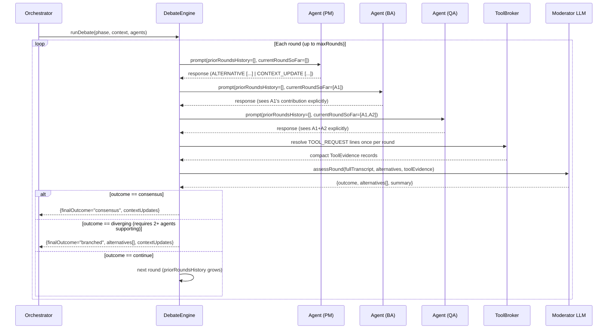
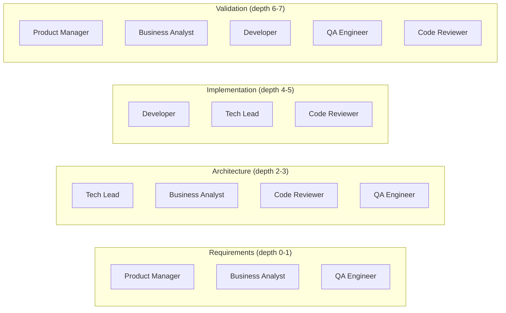
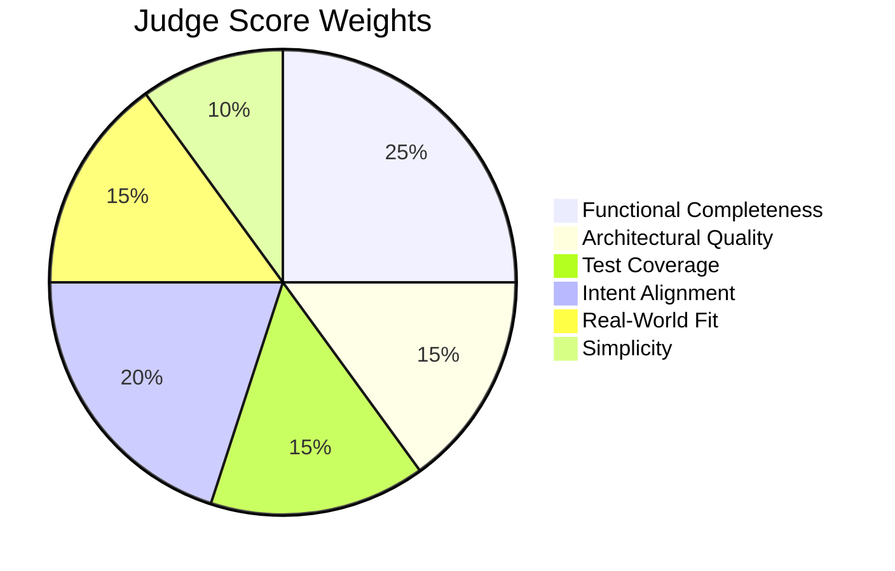
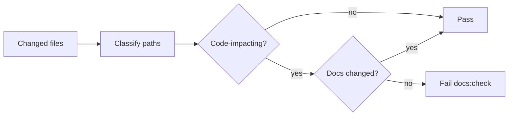

# Architecture

## System Overview

Three layers with strict downward dependencies:

```
┌─────────────────────────────────────────────┐
│  Interface Layer                            │
│  src/cli/index.ts · src/ui/                 │
│  CLI commands · saved-run browser UI        │
└────────────────────┬────────────────────────┘
                     │
┌────────────────────▼────────────────────────┐
│  Layer 1 — Orchestrator                     │
│  src/orchestrator/orchestrator.ts           │
│  Intent dossier · traversal · pruning       │
└────────────────────┬────────────────────────┘
                     │
┌────────────────────▼────────────────────────┐
│  Layer 2 — Agent Panel                      │
│  src/agents/definitions.ts                 │
│  src/debate/engine.ts                       │
│  Round-table debate · moderator scoring     │
└────────────────────┬────────────────────────┘
                     │
┌────────────────────▼────────────────────────┐
│  Layer 3 — Execution & Judging              │
│  src/execution/codex-client.ts             │
│  src/verification/runner.ts                 │
│  src/judge/judge.ts                         │
│  Codex SDK · provider-backed LLM scoring   │
└─────────────────────────────────────────────┘
```

Internal LLM calls do not depend on a provider SDK shape directly. Analyzer,
debate, exploration synthesis, sample ground-truth extraction, and judging all
call the normalized `LLMClient` boundary exported through
`src/providers/llm-provider.ts`. That file is now a thin CTO-facing re-export of
the standalone provider runtime in `packages/llm-providers`.

The provider package owns provider definitions, model tiers, fallback policy,
usage normalization, error classification, and wire adapters. OpenAI,
OpenRouter, Gemini, DeepSeek, and EdenAI use the OpenAI-compatible adapter.
EdenAI points at the V3 gateway base URL (`https://api.edenai.run/v3`) and uses
EdenAI `provider/model` model IDs. Claude uses Anthropic's native Messages API
adapter because its wire format is different: system prompts are top-level,
`max_tokens` is required, responses return text blocks, and authentication uses
`x-api-key` plus `anthropic-version`. Both adapters normalize text and
token/cache telemetry before the rest of CTO sees the response.

When `llm-providers.config.mjs`, `.js`, `.cjs`, or `.json` exists in the repo
root, CTO maps its stages to provider-package tiers instead of adding CLI flags
for every model slot. A tier is an ordered list of provider/model candidates.
The package falls through on rate limits, timeouts, overloaded responses, and
server errors, but stops on authentication, invalid model, invalid request,
context-length, parse, or schema failures. Explicit `--provider` or `--model`
keeps the single-provider/model override behavior for a run.

Structured calls that expect JSON use a shared balanced-object extractor before
Zod validation. This keeps providers that wrap JSON in prose or markdown fences
usable while still rejecting invalid schemas. Transport/provider failures, such
as OpenRouter free-model `429` rate limits, are reported separately from parse
failures so fallbacks explain the real cause.

Gemini's provider definition sets OpenAI-compatible `reasoning_effort` to
`minimal`. Gemini 3 defaults to dynamic thinking when no effort is specified,
which can exhaust CTO's short structured-output budget before the final JSON is
complete.

## End-to-End Flow



## Saved-Run UI

`cto ui` is a local-only viewer for persisted run state. It does not participate in orchestration; it reads `.cambrian-tree/<run-id>/state.json` through the same file-store boundary used by the CLI. Set `CAMBRIAN_TREE_STORE_DIR` to point that boundary at an alternate store, which is how the test harness keeps unit-test runs out of the real saved-run history.



The UI prefers fitness scores when present, while still exposing the underlying judge composite and rationale in the inspector. Browser-specific behavior stays isolated in `src/ui/page.ts`, while testable data shaping lives in small pure modules:

- `src/ui/tree-layout.ts` — flattens `TreeNode` hierarchies and computes deterministic SVG positions.
- `src/ui/run-summary.ts` — turns `RunState` into saved-run list rows.
- `src/ui/inspector.ts` — maps a selected `TreeNode` into summary/debate/context/leaf inspector sections.
- `src/ui/server.ts` — serves the UI and JSON routes using Node built-ins.

The SVG canvas draws edges from each visible parent node to each immediate visible child node, so consensus chains and branching alternatives both reflect the rendered depth-by-depth tree structure.

Run IDs are validated before loading state so encoded path separators cannot escape the `.cambrian-tree/<run-id>/state.json` namespace.

## Node State Machine



## Debate Round Detail



## Context Propagation

Agents emit structured updates using `CONTEXT_UPDATE [field]: value` lines. These are parsed, accumulated across all rounds, and merged into every child node's `NodeContext` so downstream phases have richer context.

Before the root node is created, `IntentDossierBuilder` converts the original intent and decomposition into the run's stable fitness target: goal, user value, non-goals, constraints, acceptance criteria, required checks, risk areas, known unknowns, success signals, and failure modes. The dossier is rendered into later debate, synthesis, implementation, judging, and fitness context.

```
CONTEXT_UPDATE [prd]: The API must support pagination via cursor-based tokens
CONTEXT_UPDATE [acceptance-criteria]: Given a valid auth token, when GET /todos is called, then it returns 200 with an array
CONTEXT_UPDATE [architecture-decision]: Use JWT for stateless auth — no session store needed
CONTEXT_UPDATE [implementation-spec]: Use Prisma ORM with connection pooling via PgBouncer
CONTEXT_UPDATE [test-strategy]: Unit tests for handlers, integration tests against real Postgres via testcontainers
```

Supported agent-emitted fields: `prd`, `acceptance-criteria`, `architecture-decision`, `implementation-spec`, `test-strategy`.
Array fields (`acceptance-criteria`, `architecture-decision`) are deduplicated and appended; scalar fields take the last written value.

Human plan revisions use a separate context field, `humanRevisionPrompt`. It is written by the interactive gate, not by agents, and is rendered into later agent, synthesis, and implementation prompts under a `Human Revision` heading.

## Agent-Requested Research Tools

Personas may request read-only tools using `TOOL_REQUEST [tool-name]: query` in their debate response. The DebateEngine collects requests after every agent has spoken, then calls the ToolBroker once before moderator assessment. The broker validates allowlists and budgets, executes read-only adapters, deduplicates equivalent requests, and persists both requests and evidence.

Tool evidence is rendered as compact decision-grade context: findings, decision relevance, discovered constraints, risks, open questions, sources, limitations, and confidence. The full structured evidence remains in saved run state and the saved-run UI.

The local `repo-map` adapter provides structure-first evidence for repository overview questions by listing root files, top-level directories, and representative files. Debate preflight prefers `repo-map` for codebase-structure intents when the tool is allowlisted, avoiding incidental content matches for generic terms like `codebase`.

The local `repo-search` adapter uses a backend stack: ripgrep first, Git-tracked files second, and a filesystem walk with generated-directory excludes last. Missing ripgrep is recorded as a degraded limitation, not a fatal research failure, so agents still receive repository evidence when the process `PATH` differs from an interactive shell. `CTO_RIPGREP_PATH` can pin a specific ripgrep binary.

## Interactive Plan Gate

`--interactive-plan` adds a human checkpoint after debate traversal produces candidate leaves and before execution or synthesis begins. It is intentionally terminal-first and does not require saved-run UI changes.

For each original candidate leaf, the human can choose:

- `proceed` — persist `TreeNode.humanIntervention.action = "proceed"` and execute the leaf normally.
- `revise` — persist the revision prompt, create a `human-revision` child with `NodeContext.humanRevisionPrompt`, and run normal CTO debate for that child.
- `kill` — persist `TreeNode.humanIntervention.action = "kill"`, mark the node `pruned`, and exclude it from execution, synthesis, scoring, and ranking.

The gate is one-shot in v1: descendants of a human revision are eligible for execution but are not prompted again. If every candidate leaf is killed, the run is saved as `paused` with no execution attempted. `cto resume` preserves completed human decisions and only prompts leaves that still need review.

## Tree Structure Example

A run with `--depth 4 --branching 2` on *"Build a REST API"*:

```
root (depth 0) — requirements debate
├── REST approach (depth 1) — architecture debate
│   ├── PostgreSQL backend (depth 2) — implementation debate
│   │   └── leaf → sketch rank 8.4 → Codex exec → verify → fitness 8.9/10
│   └── MongoDB backend (depth 2) — implementation debate
│       └── leaf → sketch rank 6.1 → skipped before Codex
└── GraphQL approach (depth 1) — architecture debate
    ├── Apollo Server (depth 2) — implementation debate
    │   └── leaf → sketch rank 7.7 → Codex exec → verify → fitness 7.8/10
    └── Pothos schema-first (depth 2) — implementation debate
        └── leaf → sketch rank 5.8 → skipped before Codex
```

The judge composite remains available, but final implementation rankings use the deterministic fitness composite when it exists. Fitness weights verification evidence most heavily, then combines functional completeness, maintainability, simplicity, intent alignment, risk reduction, cost efficiency, and an uncertainty penalty. Required verification failures cap the composite so a branch with failing checks cannot win on judge prose alone. Sketch ranking happens before Codex execution, so skipped leaves remain inspectable without paying for full implementation.

## Agent Participation by Phase

The analyzer selects an intent-grounded agent panel before traversal. If the selected panel has no role for a phase, CTO falls back to the core phase roster below. Optional specialists are available but not part of fallback defaults: Research Planner, Data Engineer, Data Analyst, Security Engineer, ML Engineer, DevOps Engineer, UX Designer, Frontend Engineer, API / Integration Architect, Performance Engineer, and Technical Writer.



## Scoring Weights



## File Structure

```
src/
├── cli/index.ts              # CLI entry (commander) — run, list, show, tree, ui, resume
├── types/index.ts            # All shared types (TreeNode, RunConfig, HumanIntervention, JudgeScore, …)
├── schemas/index.ts          # Zod schemas for LLM response validation
├── docs/impact-check.ts      # Documentation drift guard used by npm run docs:check
├── analyzer/
│   ├── intent-decomposer.ts  # Extract load-bearing claims, unknowns, and feasibility flags
│   ├── intent-dossier.ts     # Build the stable goal / acceptance / risk dossier
│   └── task-analyzer.ts      # Select run mode and specialist agents
├── utils/retry.ts            # Exponential-backoff retry wrapper
├── utils/pruning.ts          # Confidence × relevance pruning and depth schedules
├── agents/definitions.ts     # Agent system prompts + buildAgentPrompt + parseAgentResponse
├── debate/engine.ts          # DebateEngine — round-table loop + moderator assessment
├── orchestrator/orchestrator.ts  # TreeOrchestrator — main loop, interactive gate, SIGINT, token budget
├── execution/codex-client.ts # CodexExecutor — SDK + CLI fallback
├── judge/judge.ts            # Judge — LLM scoring
├── judge/fitness.ts          # Evidence-aware deterministic fitness scoring
├── verification/runner.ts    # Post-leaf verification command runner
├── persistence/file-store.ts # FileStore — .cambrian-tree/<run-id>/state.json
├── persistence/store-path.ts # Store path resolution and CAMBRIAN_TREE_STORE_DIR override
└── ui/                       # Local saved-run browser UI
    ├── server.ts             # HTTP server + JSON API routes
    ├── page.ts               # Dependency-free browser app shell
    ├── tree-layout.ts        # TreeNode → SVG layout
    ├── run-summary.ts        # RunState → run list summary
    └── inspector.ts          # TreeNode → inspector view model
```

## Documentation Impact Guard

`npm run docs:check` prevents code/documentation drift in the normal development loop. It collects committed branch changes against the base branch plus staged, unstaged, and untracked files. If any code-impacting path changes without a matching documentation path, the command fails before Vitest.

Code-impacting paths include `src/**`, `tests/**`, `scripts/**`, package metadata, TypeScript/Vitest/ESLint config, and workflow files. Documentation paths include `README.md`, `AGENTS.md`, `CLAUDE.md`, and `docs/**`.



For a genuinely mechanical change with no user-facing, agent-facing, or architecture impact, `DOCS_IMPACT=none npm run docs:check` is the explicit override. The override is intentionally noisy so skipping documentation is a deliberate choice.

## Retry & Resilience

All LLM calls go through `withRetry` (3 attempts, exponential backoff: 1 s → 2 s → 4 s). Parse failures fall back gracefully — the moderator defaults to `continue` (or `consensus` on the last round) rather than crashing the tree.

```
LLM call
  └─ attempt 1 → fail → wait 1s
  └─ attempt 2 → fail → wait 2s
  └─ attempt 3 → fail → throw
                          └─ caught by caller → fallback value returned
```

## Graceful Shutdown

Pressing **Ctrl+C** during a run triggers a `SIGINT` handler that:
1. Sets run status to `"paused"`
2. Saves current tree state to disk
3. Prints the resume command (`cto resume <run-id>`)
4. Exits with code 130

The handler is removed after a normal run completes.

Interactive plan gate state is persisted the same way. Already-reviewed leaves keep their `humanIntervention`, revised branches remain normal child nodes, and killed leaves remain `pruned` on resume.
