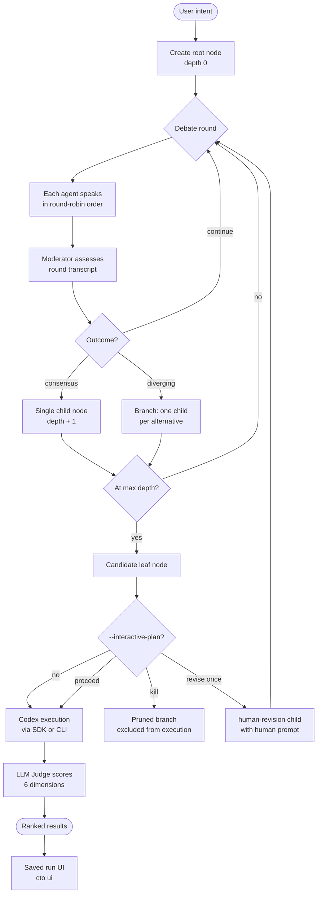
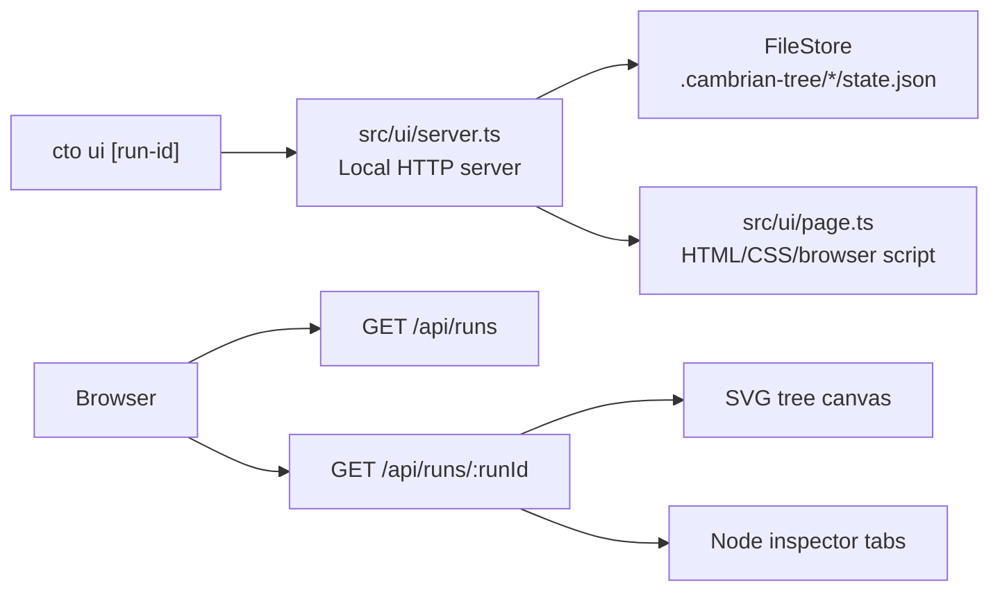
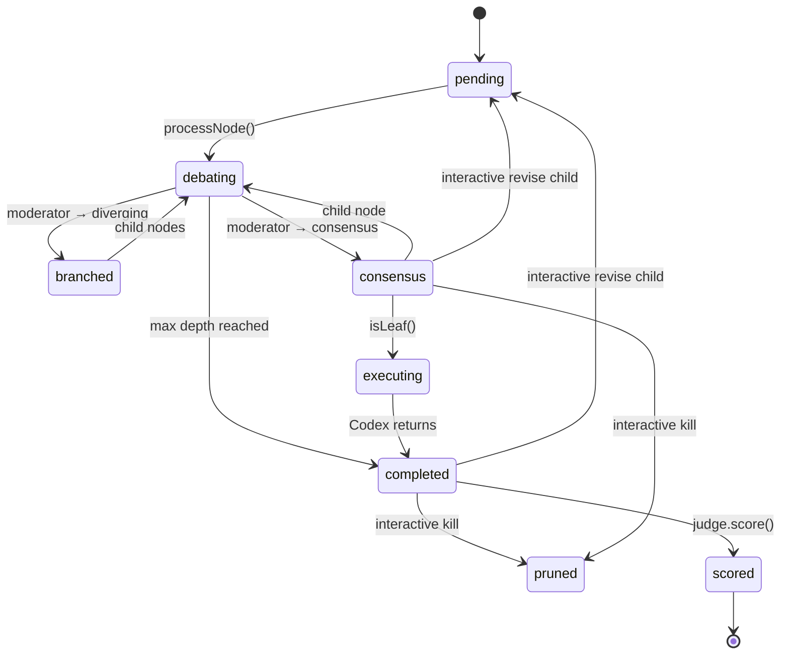
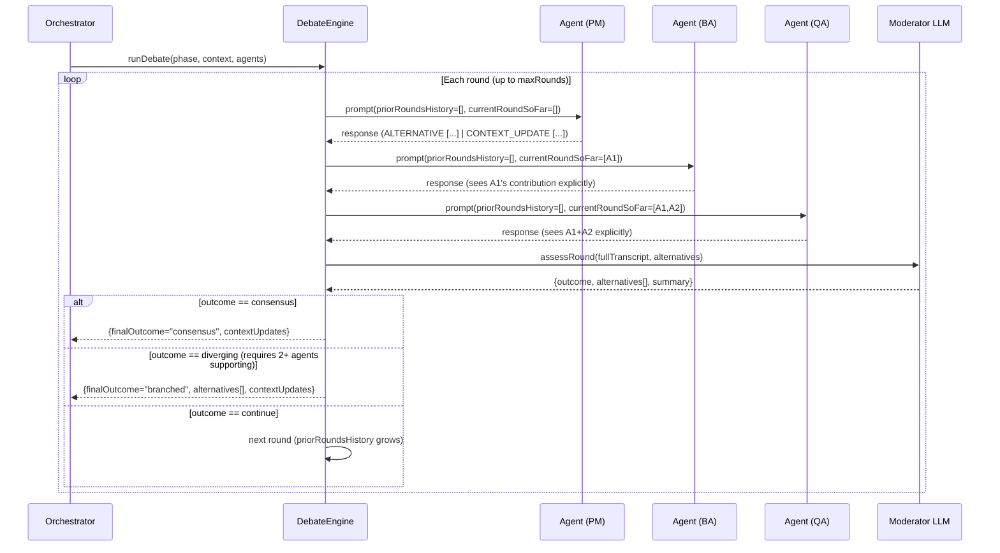
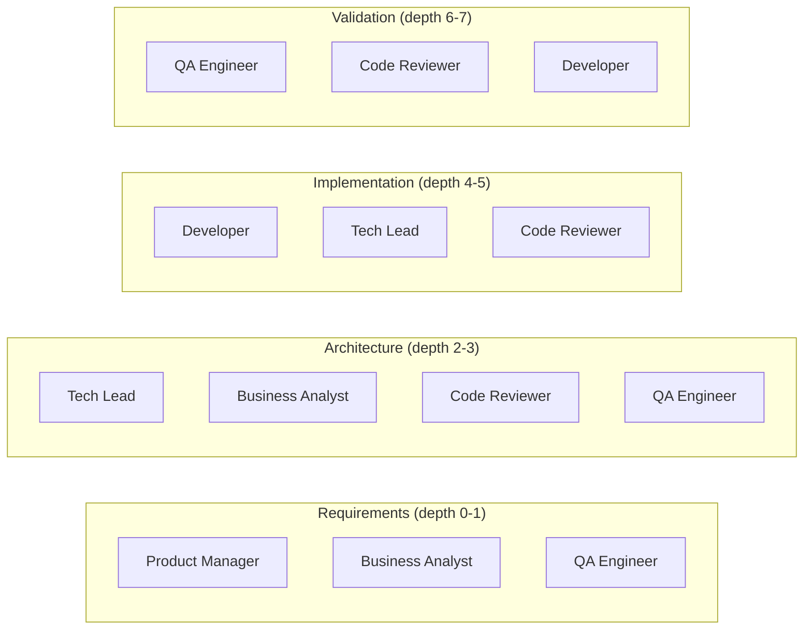
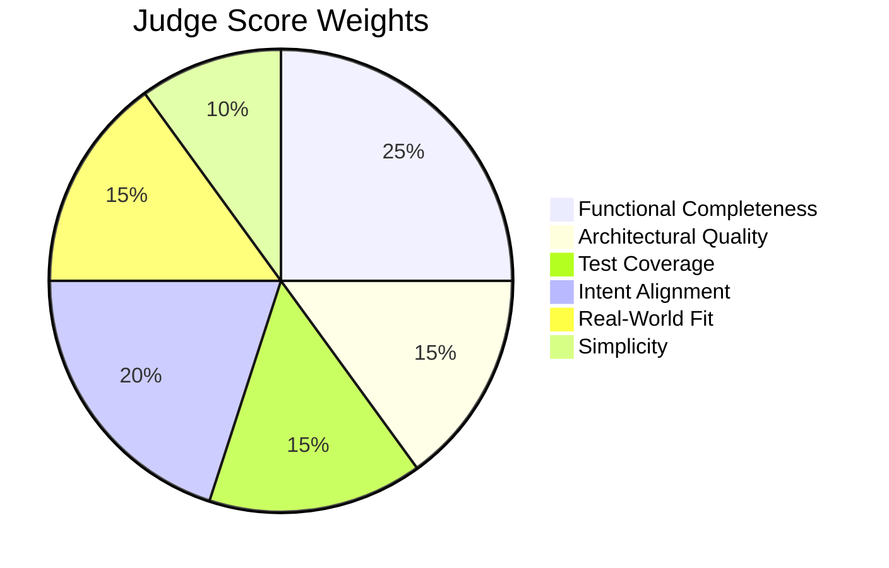

# Architecture

## System Overview

Three layers with strict downward dependencies:

```
┌─────────────────────────────────────────────┐
│  Interface Layer                            │
│  src/cli/index.ts · src/ui/                 │
│  CLI commands · saved-run browser UI        │
└────────────────────┬────────────────────────┘
                     │
┌────────────────────▼────────────────────────┐
│  Layer 1 — Orchestrator                     │
│  src/orchestrator/orchestrator.ts           │
│  Tree traversal · branching · state mgmt    │
└────────────────────┬────────────────────────┘
                     │
┌────────────────────▼────────────────────────┐
│  Layer 2 — Agent Panel                      │
│  src/agents/definitions.ts                 │
│  src/debate/engine.ts                       │
│  Round-table debate · moderator scoring     │
└────────────────────┬────────────────────────┘
                     │
┌────────────────────▼────────────────────────┐
│  Layer 3 — Execution & Judging              │
│  src/execution/codex-client.ts             │
│  src/judge/judge.ts                         │
│  Codex SDK · LLM scoring                   │
└─────────────────────────────────────────────┘
```

## End-to-End Flow



## Saved-Run UI

`cto ui` is a local-only viewer for persisted run state. It does not participate in orchestration; it reads `.cambrian-tree/<run-id>/state.json` through the same file-store boundary used by the CLI.



The UI keeps browser-specific behavior isolated in `src/ui/page.ts`, while testable data shaping lives in small pure modules:

- `src/ui/tree-layout.ts` — flattens `TreeNode` hierarchies and computes deterministic SVG positions.
- `src/ui/run-summary.ts` — turns `RunState` into saved-run list rows.
- `src/ui/inspector.ts` — maps a selected `TreeNode` into summary/debate/context/leaf inspector sections.
- `src/ui/server.ts` — serves the UI and JSON routes using Node built-ins.

Run IDs are validated before loading state so encoded path separators cannot escape the `.cambrian-tree/<run-id>/state.json` namespace.

## Node State Machine



## Debate Round Detail



## Context Propagation

Agents emit structured updates using `CONTEXT_UPDATE [field]: value` lines. These are parsed, accumulated across all rounds, and merged into every child node's `NodeContext` so downstream phases have richer context.

```
CONTEXT_UPDATE [prd]: The API must support pagination via cursor-based tokens
CONTEXT_UPDATE [acceptance-criteria]: Given a valid auth token, when GET /todos is called, then it returns 200 with an array
CONTEXT_UPDATE [architecture-decision]: Use JWT for stateless auth — no session store needed
CONTEXT_UPDATE [implementation-spec]: Use Prisma ORM with connection pooling via PgBouncer
CONTEXT_UPDATE [test-strategy]: Unit tests for handlers, integration tests against real Postgres via testcontainers
```

Supported agent-emitted fields: `prd`, `acceptance-criteria`, `architecture-decision`, `implementation-spec`, `test-strategy`.
Array fields (`acceptance-criteria`, `architecture-decision`) are deduplicated and appended; scalar fields take the last written value.

Human plan revisions use a separate context field, `humanRevisionPrompt`. It is written by the interactive gate, not by agents, and is rendered into later agent, synthesis, and implementation prompts under a `Human Revision` heading.

## Interactive Plan Gate

`--interactive-plan` adds a human checkpoint after debate traversal produces candidate leaves and before execution or synthesis begins. It is intentionally terminal-first and does not require saved-run UI changes.

For each original candidate leaf, the human can choose:

- `proceed` — persist `TreeNode.humanIntervention.action = "proceed"` and execute the leaf normally.
- `revise` — persist the revision prompt, create a `human-revision` child with `NodeContext.humanRevisionPrompt`, and run normal CTO debate for that child.
- `kill` — persist `TreeNode.humanIntervention.action = "kill"`, mark the node `pruned`, and exclude it from execution, synthesis, scoring, and ranking.

The gate is one-shot in v1: descendants of a human revision are eligible for execution but are not prompted again. If every candidate leaf is killed, the run is saved as `paused` with no execution attempted. `cto resume` preserves completed human decisions and only prompts leaves that still need review.

## Tree Structure Example

A run with `--depth 4 --branching 2` on *"Build a REST API"*:

```
root (depth 0) — requirements debate
├── REST approach (depth 1) — architecture debate
│   ├── PostgreSQL backend (depth 2) — implementation debate
│   │   └── leaf → Codex exec → score 8.2/10 🥇
│   └── MongoDB backend (depth 2) — implementation debate
│       └── leaf → Codex exec → score 6.7/10 🥉
└── GraphQL approach (depth 1) — architecture debate
    ├── Apollo Server (depth 2) — implementation debate
    │   └── leaf → Codex exec → score 7.8/10 🥈
    └── Pothos schema-first (depth 2) — implementation debate
        └── leaf → Codex exec → score 5.9/10
```

## Agent Participation by Phase



## Scoring Weights



## File Structure

```
src/
├── cli/index.ts              # CLI entry (commander) — run, list, show, tree, ui, resume
├── types/index.ts            # All shared types (TreeNode, RunConfig, HumanIntervention, JudgeScore, …)
├── schemas/index.ts          # Zod schemas for LLM response validation
├── utils/retry.ts            # Exponential-backoff retry wrapper
├── agents/definitions.ts     # Agent system prompts + buildAgentPrompt + parseAgentResponse
├── debate/engine.ts          # DebateEngine — round-table loop + moderator assessment
├── orchestrator/orchestrator.ts  # TreeOrchestrator — main loop, interactive gate, SIGINT, token budget
├── execution/codex-client.ts # CodexExecutor — SDK + CLI fallback
├── judge/judge.ts            # Judge — LLM scoring
├── persistence/file-store.ts # FileStore — .cambrian-tree/<run-id>/state.json
└── ui/                       # Local saved-run browser UI
    ├── server.ts             # HTTP server + JSON API routes
    ├── page.ts               # Dependency-free browser app shell
    ├── tree-layout.ts        # TreeNode → SVG layout
    ├── run-summary.ts        # RunState → run list summary
    └── inspector.ts          # TreeNode → inspector view model
```

## Retry & Resilience

All LLM calls go through `withRetry` (3 attempts, exponential backoff: 1 s → 2 s → 4 s). Parse failures fall back gracefully — the moderator defaults to `continue` (or `consensus` on the last round) rather than crashing the tree.

```
LLM call
  └─ attempt 1 → fail → wait 1s
  └─ attempt 2 → fail → wait 2s
  └─ attempt 3 → fail → throw
                          └─ caught by caller → fallback value returned
```

## Graceful Shutdown

Pressing **Ctrl+C** during a run triggers a `SIGINT` handler that:
1. Sets run status to `"paused"`
2. Saves current tree state to disk
3. Prints the resume command (`cto resume <run-id>`)
4. Exits with code 130

The handler is removed after a normal run completes.

Interactive plan gate state is persisted the same way. Already-reviewed leaves keep their `humanIntervention`, revised branches remain normal child nodes, and killed leaves remain `pruned` on resume.
