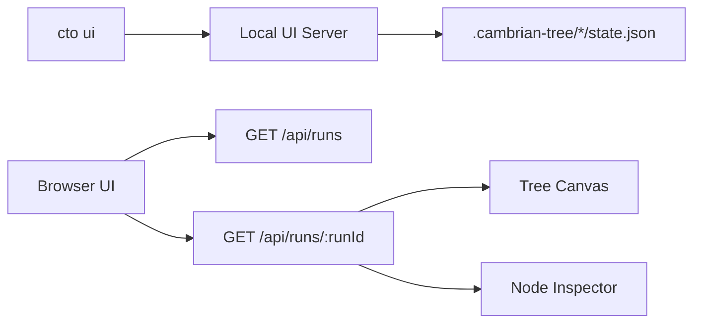

# Saved Run UI Explorer

**Date:** 2026-04-28  
**Status:** Draft for review

## Overview

Add a `cto ui` command that launches a local browser-based explorer for saved Cambrian Tree Orchestrator runs. The first version focuses on inspecting existing run state from `.cambrian-tree/<run-id>/state.json`, not on building a full live event monitor.

The UI uses the approved Explorer Canvas direction:

- Left panel: saved run picker.
- Center panel: interactive tree canvas showing nodes, branches, statuses, phases, and leaf scores.
- Right panel: selected node inspector with tabs for summary, debate, context, and leaf results.

## Goals

- Make saved CTO runs easier to understand than terminal-only `tree` and `show` output.
- Let users move from a high-level branch map to the exact debate, inherited context, execution result, score, and changed files for any node.
- Keep the implementation small and TypeScript-first.
- Preserve the current CLI workflow and persistence model.
- Design the server/API boundary so a later live-ish polling view can reuse it.

## Non-Goals

- No dedicated WebSocket or event-stream live monitor in v1.
- No hosted or multi-user web app.
- No editing run state from the UI.
- No applying Codex Cloud results from the UI.
- No full frontend framework or bundler unless the dependency-light approach proves too limiting during implementation.

## Command UX

`cto ui` starts a local HTTP server and prints the local URL. If possible, it also opens the default browser.

```bash
cto ui
```

Default behavior:

- Serve the UI at `http://localhost:<port>`.
- Choose an available port, starting from a sensible default.
- Load saved runs from the same `.cambrian-tree` store used by existing commands.
- Show a run picker if no run id is supplied.

Optional deep link:

```bash
cto ui <run-id>
```

If a run id is provided, the UI opens with that run selected. Invalid run ids show a clear empty/error state while preserving the run picker.

## Information Architecture

### Run Picker

The left panel lists saved runs sorted by newest first. Each row shows:

- Intent summary.
- Run status.
- Started time.
- Leaf count.
- Best score when available.

Selecting a run loads its tree into the canvas and selects the root node by default.

### Tree Canvas

The center panel renders the `TreeNode` hierarchy as a left-to-right tree:

- Node label: `branchLabel` or `root`.
- Secondary text: phase and status.
- Color strip: phase.
- Border/status treatment: pending, debating, branched, consensus, executing, completed, scored, pruned.
- Score badge on scored leaves.
- Edges connecting parent and child nodes.

Canvas controls:

- Fit to view.
- Zoom in/out.
- Reset zoom.
- Pan by dragging the canvas.
- Click node to select.

Filters can be minimal in v1:

- Show/hide pruned nodes.
- Highlight scored leaves.

### Node Inspector

The right panel updates when a node is selected.

Tabs:

- **Summary:** branch description, depth, phase, status, timestamps, debate summary, ancestor path.
- **Debate:** rounds, agent messages, alternatives, moderator outcome, confidence, and support.
- **Context:** `NodeContext` fields including PRD, acceptance criteria, architecture decisions, branch decision, implementation spec, test strategy, and ancestor summaries.
- **Leaf:** execution result, success/failure, changed files, test results, duration, Codex usage, judge score dimensions, composite score, and rationale. For non-leaf nodes, this tab shows an empty state.

## Technical Design

### New CLI Command

Add a `ui [run-id]` command in `src/cli/index.ts`.

Responsibilities:

- Resolve the store directory using existing `FileStore` behavior.
- Start the UI server.
- Print the URL.
- Keep the process alive until interrupted.

### UI Server

Add a small TypeScript server module, for example `src/ui/server.ts`, using Node built-ins:

- `node:http`
- `node:url`
- `node:path`
- `node:fs/promises`

No Express dependency is needed for v1.

Routes:

- `GET /` returns the HTML shell.
- `GET /api/runs` returns saved run summaries.
- `GET /api/runs/:runId` returns the full `RunState`.
- `GET /api/health` returns a minimal health response.

The server should return JSON errors with appropriate HTTP status codes for missing or invalid runs.

### Client UI

Keep the client dependency-free in v1. The server can serve a static HTML shell with embedded CSS and a small browser script. To keep repository code TypeScript-first, store the shell and script generation in TypeScript modules rather than separate JavaScript source files.

Core client state:

- `runs`
- `selectedRunId`
- `selectedRun`
- `selectedNodeId`
- viewport transform `{ scale, x, y }`
- filters `{ showPruned }`

Rendering strategy:

- Convert the nested `TreeNode` hierarchy into flat node and edge arrays.
- Compute a deterministic tree layout from depth and sibling order.
- Render nodes and edges in SVG for predictable pan/zoom behavior.
- Render inspector content with normal HTML.

The layout algorithm can be simple for v1:

- X position = `depth * columnWidth`.
- Y position = leaf-order-based vertical slots.
- Parent Y = average of child Y positions.
- Single-child consensus chains remain readable.

### Data Flow



## Error Handling

- If no runs exist, show an empty state with the command users can run to create one.
- If a run is missing or malformed, show an error panel and keep the run picker usable.
- If the server cannot bind the preferred port, try the next port.
- If browser opening fails, print the URL and continue serving.
- If a node is missing expected optional fields, render a quiet empty state rather than crashing the UI.

## Testing

Focused tests should cover:

- API run summary generation from sample `RunState`.
- Tree flattening and layout for:
  - root-only tree
  - consensus chain
  - branching tree
  - scored leaves
  - pruned nodes
- Inspector data selection for summary, debate, context, and leaf sections.

Manual verification:

- Run `npm run typecheck`.
- Run `npm test` if tests are added.
- Start `cto ui` against sample saved state.
- Verify run selection, node selection, pan/zoom controls, and tab switching in a browser.

## Future Extensions

- Poll selected run state every few seconds for live-ish updates during an active run.
- Add search by node id, branch label, agent role, changed file, or score rationale.
- Add side-by-side leaf comparison.
- Add direct links to leaf working directories.
- Add export to PNG/SVG for the tree canvas.
- Upgrade to a bundled frontend stack if the UI grows beyond the dependency-free shell.

## Acceptance Criteria

- `cto ui` launches a local saved-run viewer.
- The viewer lists saved runs from `.cambrian-tree`.
- Selecting a run renders its full tree.
- Selecting a node updates the inspector.
- The inspector exposes summary, debate, context, and leaf information.
- Scored leaves display their composite score.
- The implementation compiles with the existing TypeScript configuration.
- Existing CLI commands continue to work.
